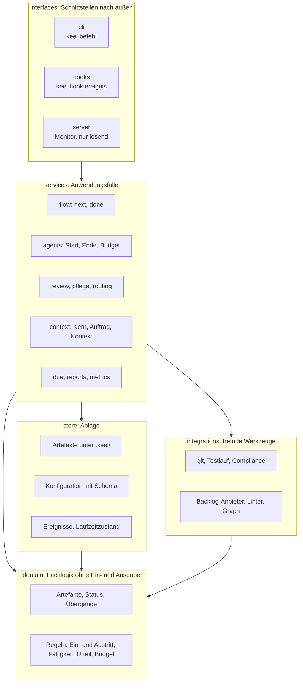

# Der Kern von keel: vom Skriptbündel zum Programm

2026-10-01 · Konzeptentwurf. Grundlage: Bestandsaufnahme des Kerns auf dem Branch `review-threshold` (Plugin 0.13.0), die Befunde in `kern-befunde.md` und die Konzeptentwürfe `kontext-scope.md` (PR #4) und `ablauf-beschleunigen.md` (PR #5).

**Stand 2026-10-05:** M0 ist umgesetzt (Arbeitspaket 1, System-ADR 0019, 0.14.0), M1 ebenso (Arbeitspaket 2, System-ADR 0020, 0.15.0), M2 ebenso (Arbeitspaket 4, System-ADR 0022, 0.17.0). Abweichungen vom Entwurf stehen jeweils am Ort, die beantworteten Fragen unter „Offene Fragen“. Ab M3 gilt der Text weiter als Entwurf.

## Kurzfassung

Der Kern von keel ist aus einzelnen Skripten gewachsen: rund 3000 Zeilen Python unter `scripts/`, rund 800 Zeilen Bash unter `hooks/`, verbunden über Kommandozeilen-Aufrufe, `eval` und `sys.path`-Tricks. Er trägt inzwischen alles, was keel verlässlich macht: Gates, Budgets, Review-Urteile, Fälligkeiten, Kennzahlen, Monitor. Das funktioniert, ist aber nicht robust. Gates lassen bei Fehlern durch, Grundlagen sind fünf- bis achtfach kopiert, Regeln stehen teils in Python, teils in Bash, teils nur in Prosa, und es gibt kaum Tests.

Vorgeschlagen wird ein Python-Paket `keel` mit klar getrennten Schichten:
- **Fachlogik ohne Ein- und Ausgabe** (`domain`): Artefakte, Status, Übergänge, Regeln.
- **Ablage** (`store`): Dateien, Konfiguration, Ereignisse, Laufzeitzustand.
- **Fremde Werkzeuge** (`integrations`): Git, Tests, Compliance, Backlog-Anbieter, Linter.
- **Anwendungsfälle** (`services`): nächster Schritt, Rollenstart und -ende, Review, Kontext, Berichte.
- **Schnittstellen nach außen** (`interfaces`): Kommandozeile `keel`, ein Dispatcher für alle Hooks, der Monitor-Server.

Der Umbau läuft schrittweise, ohne Bruch, und beginnt mit dem Sicherheitsnetz aus `kern-befunde.md`.

## Ausgangslage

### Was der Kern heute tut

| Bereich | Heute | Aufgerufen von |
| --- | --- | --- |
| Artefakte lesen und schreiben | `frontmatter.py` mit eigenem YAML-Teilparser, dazu sieben eigene `fm()`-Varianten | fast allem, 16 Stellen in Skills und Agenten |
| Konfiguration | `config.py` (zwei Ebenen, nur Skalare), dazu ein Handparser in `backlog.py` | Hooks über `$CFG`, acht Python-Importe |
| Eintrittsregeln | `flow.py` (`GATES`), die eigentliche Prüfung aber in `agent-gate.sh` | PreToolUse Agent, Monitor |
| Austrittsregeln | nur in `agent-stop.sh` | SubagentStop |
| Nächster Schritt | `flow.py` (`NEXT_*`, gespiegelte Prosa), maßgeblich aber die Prosa in `skills/vorhaben/SKILL.md` | nur Monitor |
| Budgets | `tool-gate.sh`, `agent-stop.sh`, `context-alarm.sh`, `lib.sh` | Hooks |
| Git | verteilt auf `review.py`, `due.py`, `compliance_scan.py`, `metrics.py`, `lage.py`, `guard.sh`; Branch, Commit, Merge nur als Prosa in Skills | Skills, Hooks |
| Prüftor | `gate.sh` | Stop-Hook, fünf Skills |
| Compliance | `compliance_scan.py` | Stop-Hook |
| Review-Urteil, Pflegeliste, Befund-Routing | `review.py`, `pflege.py`, `route_findings.py` | Hooks, Architekt, Tagesstart |
| Fälligkeiten | `due.py`, `briefing_needed.py` | vier Hooks, fünf Skills, zwei Runner |
| Ereignisse und Kennzahlen | `lib.sh:record`, `log.sh`, `metrics.py`, `models.py` | Hooks, Coach, Inbox, Briefing |
| Berichte | `lage.py`, `check_references.py` | Hilfe, Stop, Monitor, Auditor |
| Monitor | `monitor.py` und `monitor.html` | Skill, Autostart, Runner |
| Einrichtung und Runner | `init.sh`, `merge_settings.py`, `keel.sh`, `keel-run.sh` | Terminal, Skill `init` |
| Backlog | `backlog.py` (Markdown, GitHub) | Skill, PO, Routing |

### Was dabei schiefläuft

Ausführlich in `kern-befunde.md`. Die strukturellen Ursachen dahinter:

1. **Keine gemeinsame Grundlage.** Ereignisse laden gibt es fünfmal mit drei Arten, Zeitstempel zu lesen. Frontmatter lesen siebenmal, Konfiguration achtmal, den Pfad zum Kennzahlen-Ordner zehnmal. Jede Kopie behandelt Fehler anders.
2. **Regeln an drei Orten.** Status und Übergänge stehen in `flow.py`, in Bash-Whitelists und in der Prosa der Agenten und Skills. `abgeschlossen` und `verworfen` für Pläne stehen nur in Berichten und werden nirgends gesetzt.
3. **Kein Fehlervertrag.** Exit-Codes bedeuten je Skript etwas anderes. Hooks wissen nicht, ob ein Fehler „Regel verletzt“ oder „Programm kaputt“ heißt, und lassen im Zweifel durch.
4. **Seiteneffekte überall.** Logik ist mit `print` und `sys.exit` verwoben. Das Review-Urteil lässt sich nicht als Funktion aufrufen und deshalb nicht testen.
5. **Zwei Sprachen für dieselbe Sache.** `transcript_model` gibt es in Bash und Python, Defaults stehen im Template und hart im Code.
6. **Teuer pro Aufruf.** Ein `Edit` einer Rolle startet 14 `jq`- und 5 Python-Prozesse, rund eine Sekunde.

## Leitlinien

1. **Ein Programm, ein Paket, ein Einstiegspunkt.** Alles läuft über `keel <befehl>` oder `keel hook <ereignis>`. Kein Skill, kein Agent und kein Hook ruft ein Skript mit Pfad auf.
2. **Getrennte Zuständigkeiten mit fester Richtung.** Fachlogik kennt keine Dateien, Ablage kennt keine Regeln, Schnittstellen enthalten keine Logik. Die Richtung prüft ein Test.
3. **Eine Quelle für jede Regel.** Status, Übergänge, Ein- und Austrittsbedingungen, Defaults, Pfade und Modellnamen stehen genau einmal im Code. Prosa beschreibt, Code entscheidet.
4. **Gates schließen bei Fehlern, Beobachter laufen weiter.** Ein Gate, das abstürzt, blockiert mit klarer Meldung. Ein Protokoll, das abstürzt, darf die Arbeit nicht aufhalten.
5. **Daten gehen nicht verloren.** Schreiben ist atomar, gleichzeitige Zugriffe sind gesperrt, Lesen ist tolerant und meldet kaputte Einträge, statt abzustürzen.
6. **Nur Standardbibliothek, Python 3.9.** Das ist der Stand von `/usr/bin/python3` auf macOS. Kein `pip install`, kein `jq` mehr als Pflicht. Fremde Werkzeuge (Linter, `gh`) sind optional und werden erkannt.
7. **Testbar von unten nach oben.** Fachlogik ohne Ein- und Ausgabe ist mit reinen Unit-Tests prüfbar. Jede Schicht darüber hat eigene Tests.

## Zielarchitektur

### Schichten



| Schicht | Aufgabe | Darf nutzen | Darf nicht |
| --- | --- | --- | --- |
| `domain` | Artefakttypen, Felder, Status und erlaubte Übergänge, Regeln als reine Funktionen | nur Standardbibliothek | Dateien lesen, Prozesse starten, `print`, `sys.exit` |
| `store` | Artefakte, Konfiguration, Ereignisse und Laufzeitzustand lesen und schreiben, atomar und gesperrt | `domain` (Typen) | Regeln entscheiden |
| `integrations` | Fremde Werkzeuge aufrufen und ihre Ausgaben in Domänenobjekte übersetzen | `domain` (Typen) | Regeln entscheiden, Artefakte schreiben |
| `services` | Anwendungsfälle zusammensetzen: Zustand laden, Regel anwenden, Ergebnis speichern | `domain`, `store`, `integrations` | Protokoll von Claude Code kennen, Text formatieren |
| `interfaces` | Eingaben lesen, Service aufrufen, Ergebnis in das Format des Aufrufers übersetzen | `services` | Logik enthalten |

### Paketstruktur

```
bin/keel                     Startskript, ruft keel.interfaces.cli über lib/keel_main.py (umgesetzt in M1:
                             die Python-Version prüft das Paket selbst beim Import)
lib/keel/
  domain/
    artifacts.py             Typen: Plan, Aufgabe, Epic, Review, Vorlage, ADR, Backlog-Eintrag, Pflege-Eintrag
    statuses.py              Status je Typ und erlaubte Übergänge (die eine Quelle)
    flow.py                  Eintritts- und Austrittsbedingungen je Rolle und Anlass, nächster Schritt
    due.py                   Fälligkeitsregeln als reine Funktionen
    review.py                Review-Urteil mit ausdrücklicher Trendregel
    budget.py                Budgetregeln je Rolle und Anlass
    pflege.py                Regeln der Pflegeliste
    profiles.py              Kontextprofile je Anlass (aus dem Kontextkonzept)
    events.py                Ereignistypen mit Feldern und Version
    errors.py                Fehlerhierarchie
  store/
    paths.py                 Alle Pfade: Projekt, .keel/, Laufzeit-Ordner mit Projektschlüssel
    codec.py                 Ein YAML-Teilparser für Frontmatter und Konfiguration, mit Round-Trip-Tests
    artifacts.py             Repository für Artefakte unter .keel/
    config.py                Konfiguration mit Schema und Defaults
    events.py                Ereignisse anhängen (atomar) und lesen (tolerant, inkrementell)
    runtime.py               Laufzeitzustand der Agenten: pending, Zähler, Startzeit, mit Sperren
    io.py                    atomic_write, file_lock
  integrations/
    git.py  testrun.py  compliance.py  transcript.py  claude.py
    backlog/ markdown.py  github.py
    filters/                 Ausgabefilter je Werkzeug
    graph.py                 Importgraph und Kennzahlen (Architektur-Strang A1)
  services/
    flow.py                  next, done
    agents.py                Start prüfen, Kontext einspielen, Ende prüfen, Budget
    context.py               Rollenkern, Auftrag und Kontext zusammensetzen
    review.py  pflege.py  routing.py
    due.py  reports.py  metrics.py  models.py
    setup.py                 Einrichtung (heute init.sh, merge_settings.py)
  interfaces/
    cli.py                   argparse, ein Unterbefehl je Anwendungsfall
    hooks.py                 Dispatcher: Payload lesen, Service rufen, Antwort für Claude Code bauen
    server/ app.py  static/monitor.html
    output.py                Kurze Textausgabe, --json, Exit-Codes
hooks/hooks.json             ruft für jedes Ereignis bin/keel hook <ereignis>
agents/  skills/  templates/  auftraege/   Motor-Inhalte wie bisher
tests/
  domain/  store/  integrations/  services/  hooks/  cli/  fixtures/
```

Umgesetzt in M1: `domain/errors.py`; `store/` mit `paths.py`, `codec.py`, `frontmatter.py`, `config.py`, `events.py`, `io.py`; `services/doctor.py`; `interfaces/cli.py`; Tests unter `tests/unit/` statt der Unterordner oben. `store/runtime.py` (Laufzeitzustand der Agenten mit Sperren) kam in M2 dazu, ebenso `store/transcripts.py`, `services/artifacts.py` (Prüfung von Übergaben), `services/hooks/` und `interfaces/hooks.py`; `store/artifacts.py` gehört zu M3.

`agents/`, `skills/` und `hooks/hooks.json` bleiben am Ort, weil Claude Code sie dort erwartet. `scripts/` wird zum Übergangsordner mit Weiterleitungen und verschwindet am Ende.

### Querschnittsthemen

**Eine Quelle für Regeln.**
- `domain/statuses.py` hält je Artefakttyp die Status und erlaubten Übergänge.
- `domain/flow.py` hält Eintritts- und Austrittsbedingungen je Rolle und Anlass.
- Konfigurations-Defaults stehen nur im Schema in `store/config.py`. Das Template `templates/keel/config.yaml` wird weiter von Hand gepflegt, weil seine Kommentare die Bedienung erklären; ein Test hält Template und Schema gleich (entschieden in M1).
- Ein Test prüft, dass Status, die in Agenten und Skills genannt werden, im Code existieren. Prosa kann dann nicht mehr unbemerkt abdriften.

**Fehlervertrag.**
- `domain/errors.py`: `RuleViolation` (fachlich abgelehnt, mit Grund und nächstem Schritt), `InvalidArtifact` (Datei kaputt oder Feld fehlt), `ToolFailure` (Werkzeug gescheitert), `InternalError` (Fehler im Programm).
- Kommandozeile: Exit 0 erfolgreich, 1 fachlich abgelehnt, 2 Fehler im System.
- Hooks: Der Dispatcher kennt je Ereignis die Art. **Gates** (Agent-Start, Werkzeugaufruf, Agent-Ende, Skill) antworten bei jeder Ausnahme mit Ablehnung und klarer Meldung. **Beobachter** (Protokoll, Kontext-Alarm, Sessionstart) schlucken Ausnahmen und protokollieren sie. Das ist eine Stelle im Code statt einer Entscheidung in jedem Skript.

**Atomares Schreiben und Sperren.**
- `store/io.py`: `atomic_write` (Temp-Datei im selben Ordner, `fsync`, `os.replace`) und `file_lock` (`fcntl.flock`).
- Jede Schreiboperation im `store` nutzt beides. Ereignisse werden mit einem einzigen `os.write` auf eine mit `O_APPEND` geöffnete Datei unter Sperre angehängt.

**Ablage in drei getrennten Bereichen**, seit System-ADR 0021 mit einem vierten für den ganzen Rechner.

| Bereich | Ort | Inhalt | Versioniert |
| --- | --- | --- | --- |
| Motor | Plugin | Agenten, Skills, Aufträge, Vorlagen, Schema | im keel-Repo |
| Projekt | `.keel/` im Projekt | Artefakte, Konfiguration, Kontext | im Projekt-Repo |
| Laufzeit | `~/.keel-metrics/<schlüssel>/` | Ereignisse, Protokolle, Laufzeitzustand | nein |
| Maschine | `~/.keel-metrics/motor/` | Motor-Vorschläge und Motor-Befunde aller Projekte, bis eine Session im keel-Repo sie entscheidet | nein |

Der Schlüssel für die Laufzeit wird an einer Stelle aus Ordnername plus kurzem Hash des absoluten Pfads berechnet. Zwei Projekte namens `app` teilen sich dann nichts mehr.

**Formatversionen und Migration.** `.keel/config.yaml` bekommt `format: 1`, Ereignisse ein Feld `v`. `keel migrate` hebt ältere Stände an. So kann sich das Format weiterentwickeln, ohne dass bestehende Projekte brechen.

**Zeit.** Überall UTC mit Zeitzone, eine Funktion zum Lesen, eine Uhr, die sich in Tests ersetzen lässt.

**Konfiguration und Frontmatter.** Python 3.9 hat kein `tomllib`, und PyYAML ist eine Fremdabhängigkeit. Deshalb ein einziger, strikter YAML-Teilparser in `store/codec.py`: verschachtelte Abbildungen, Listen (inline und als Block), Text mit und ohne Anführungszeichen samt Escapes, Kommentare nur außerhalb von Anführungszeichen. Was er nicht versteht, lehnt er mit Zeilennummer ab, statt still falsch zu lesen. Round-Trip-Tests sichern ab, dass Lesen und Schreiben sich nicht gegenseitig beschädigen.

**Leistung.**
- Ein Hook-Ereignis ist ein Python-Prozess. Heute laufen bei `PreToolUse` zwei Skripte nacheinander (`tool-gate.sh`, `log.sh`), künftig ein Dispatcher, der Gate und Protokoll in einem Lauf erledigt. Erwartet sind rund 50 ms statt bis zu einer Sekunde.
- Ereignisse werden inkrementell gelesen: Ein kleiner Index merkt sich die letzte Leseposition und verdichtete Zähler. `due` und Monitor lesen dann nicht bei jedem Aufruf die ganze Historie.
- `jq` ist danach keine Pflicht mehr.

**Selbstdiagnose.** `keel doctor` prüft Python-Version, Git, optionale Werkzeuge, Gültigkeit der Konfiguration, verwaiste `pending`-Einträge und kaputte Zeilen im Protokoll. `/keel:hilfe` nutzt dasselbe. Umgesetzt in M1, dazu lesbare Frontmatter aller Artefakte unter `.keel/` und ein beschreibbarer Sperrordner; `keel doctor` meldet nur und räumt nichts auf.

### Hooks

Heute: elf Bash-Skripte mit eigener Logik, 73 Verweise auf feste Pfade in `/tmp`, Regeln, die nur dort stehen.

Künftig hat `hooks/hooks.json` je Ereignis genau einen Eintrag:

```json
{ "type": "command", "command": "python3 \"${CLAUDE_PLUGIN_ROOT}/bin/keel\" hook pre-tool-use", "timeout": 30 }
```

Der Dispatcher in `interfaces/hooks.py`:
1. liest den Payload und prüft ihn gegen ein kleines Schema,
2. bestimmt die Art (Gate oder Beobachter) und den Service,
3. ruft den Service mit typisierten Werten,
4. übersetzt das Ergebnis in das Antwortformat von Claude Code (Ablehnung, Block, zusätzlicher Kontext),
5. fängt jede Ausnahme nach dem Fehlervertrag ab.

Für das Agent-Ende, das die Testsuite startet, gibt es ein ausdrückliches, längeres Timeout. Läuft es ab, blockiert das Gate.

`guard.sh` darf zunächst in Bash bleiben, weil es nur Muster prüft. Er wird aber ehrlich als zweites Netz dokumentiert. Die Hauptsperren für gefährliche Befehle sind die Deny-Regeln in den Settings.

**Umgesetzt in M2 (System-ADR 0022), mit Abweichungen:** Die Schritte liegen unter `services/hooks/` und tragen die Regeln je Rolle als Funktionen, eins zu eins aus Bash; Tabellen in `domain` folgen in M3. Der Guard ist mit nach Python gezogen. Der Dispatcher führt alle Schritte eines Ereignisses nacheinander aus, auch nach einer Ablehnung (die erste gewinnt), weil die Hooks vorher parallel liefen. `due.py`, `compliance_scan.py`, `review.py`, `pflege.py`, `models.py`, `wiedervorlage.py` und `gate.sh` laufen bis M3/M4 als Unterprozess. Ohne `python3` entscheidet `bin/keel` in Bash. Der Laufzeitzustand liegt in `store/runtime.py` mit eigener Ablage je Agent, Startmarke und Session; die verwaiste Startmarke wird über Zeit und laufende Agenten erkannt, weil `SubagentStart` keine `tool_use_id` liefert.

### Monitor

Der Monitor ist schon gut abgesichert: nur `127.0.0.1`, Host-Prüfung, `safe_under`, nur lesend. Er zieht in `interfaces/server/` und bekommt seine Daten nur aus `services/reports.py`, demselben Lesemodell, das `/keel:hilfe` nutzt. Damit legt er nichts mehr selbst aus: Phase, nächster Schritt und Rollenzustände kommen aus `domain/flow.py`. Das HTML bleibt eine statische Datei. Später können Graph und Kennzahlen aus dem Architektur-Strang dort erscheinen.

### Lebenszeichen: Läuft keel gerade?

Der Kern ist kein Dienst, der dauerhaft läuft. Er läuft nur in kurzen Momenten, wenn ein Hook oder ein Befehl ausgelöst wird. Der Monitor sieht heute nur die Subagenten (`agent_start` ohne `agent_stop`). Er sieht nicht, ob eine keel-Session offen ist, was der Lead zwischen den Rollen tut, ob gerade das Prüftor minutenlang im Stop-Hook läuft oder ob ein unbeaufsichtigter Lauf auf das Ende eines Nutzungslimits wartet. Für den Menschen sieht ein Kern, der wegen eines Fehlers alles blockiert, genauso aus wie ein Kern, der nichts zu tun hat.

Vorgeschlagen wird ein Lebenszeichen auf drei Ebenen, jeweils deterministisch aus Ereignissen und Prozessprüfungen abgeleitet.

**1. Session: Ist keel offen, und was macht der Lead?**

Dazu kommen zwei Hook-Ereignisse, die keel heute nicht nutzt: `SessionEnd` und `Notification` (Claude wartet auf eine Freigabe oder ist untätig). Zusammen mit `SessionStart`, `Stop` und den Werkzeugaufrufen ergibt sich je Session ein Zustand:

| Zustand | Erkannt an |
| --- | --- |
| arbeitet | Werkzeugaufruf vor wenigen Sekunden, oder `PreToolUse` ohne passendes `PostToolUse` |
| wartet auf dich | letztes Ereignis ist `Notification` |
| Zug beendet | letztes Ereignis ist `Stop`, keine neue Eingabe |
| beendet | `SessionEnd` |
| abgebrochen | kein `SessionEnd`, aber der Prozess lebt nicht mehr |

Für „abgebrochen“ merkt sich der Dispatcher bei `SessionStart` die Prozess-ID des Claude-Prozesses, und der Monitor prüft, ob sie noch lebt. Ob der Elternprozess des Hooks wirklich Claude Code ist oder eine Shell dazwischen liegt, ist noch zu prüfen.

Aus dem offenen Werkzeugaufruf zeigt der Monitor, was der Lead gerade tut, etwa „Lead: Bash `keel gate` seit 1:20“.

**2. Kern: Welche Operation läuft gerade?**

Lange Operationen (Prüftor, Compliance-Scan, Fälligkeiten, später Graph und Lint) melden sich über einen Kontextmanager in `store/runtime.py` an und ab:

```python
with activity("prueftor", ref="T03"):
    ...
```

Er legt einen Marker mit Prozess-ID, Startzeit und Bezug unter dem Laufzeit-Ordner an und entfernt ihn am Ende, auch bei Ausnahmen. Lebt die Prozess-ID eines Markers nicht mehr, ist er verwaist. Der Monitor zeigt das als Fehler, nicht als „läuft“, und `keel doctor` meldet ihn; aufräumen bleibt bei `lage.py --clean` nach dem Ja des Menschen. Kein Befehl muss sich selbst darum kümmern.

**3. Unbeaufsichtigter Lauf: Läuft er, wartet er, ist er fertig?**

Der Runner (heute `keel-run.sh`, künftig `keel run`) schreibt seinen Zustand mit Prozess-ID in eine Datei:
- läuft
- wartet auf das Limit bis HH:MM
- Briefing nötig
- beendet mit Code

**Gesundheit.**

Mit dem Fehlervertrag unterscheidet der Dispatcher zwischen „Regel verletzt“ und „Programm kaputt“. Jeder interne Fehler wird als Ereignis `hook_error` mit Hook, Ereignis und Meldung protokolliert. Der Monitor zeigt den letzten als rote Markierung, etwa „Gate wegen Fehler geschlossen, 14:02, agent-stop“, bis er quittiert oder durch einen erfolgreichen Lauf desselben Hooks überholt ist.

**In der Oberfläche** wird das eine Statuszeile ganz oben:

```
keel ● arbeitet · Session 3f2a (Lead auf Fable) · Prüftor seit 1:20 für T03 · Runner: wartet auf Limit bis 14:30 · Kern gesund
```

| Punkt | Bedeutung |
| --- | --- |
| grün | arbeitet |
| gelb | wartet auf dich |
| grau | nichts offen |
| rot | abgebrochen, verwaister Marker oder interner Fehler |

Dieselben Zustände liefert `services/reports.py` auch an `/keel:hilfe`, damit Hilfe und Monitor dasselbe sagen.

**Umgesetzt in M2:** Ebene 1 protokolliert `SessionEnd` und `Notification` (ohne Prozess-ID, sie ist in der Hook-Doku nicht beschrieben), Ebene 2 die Marker von Prüftor und Compliance-Scan; `keel doctor` meldet verwaiste Marker. Anzeige und Runner folgen in M6.

**Einordnung in den Umbau.** Ebene 1 und der Runner sind klein und ließen sich auch im Bestand vorziehen: zwei Hook-Einträge, ein paar Zeilen im Runner, eine Auswertung im Monitor. Ebene 2 und die Gesundheitsanzeige bauen auf `store/runtime.py` und dem Fehlervertrag auf und gehören zu M1 und M2. Die Anzeige im Monitor gehört zu M6.

### Anschluss an die Konzepte

| Konzept | Wo es im Kern landet |
| --- | --- |
| Rollenkern und Auftrag je Anlass, Kontextprofile (PR #4) | `domain/profiles.py`, `services/context.py`, Aufträge unter `auftraege/`, Einspielen über den Dispatcher bei `SubagentStart` |
| Modulgraph, Kennzahlen, Ratsche (PR #4) | `integrations/graph.py`, Regeln der Ratsche in `domain`, Ergebnisse im Monitor |
| `keel next` und `keel done` (PR #5) | `services/flow.py` auf Basis von `domain/flow.py` |
| Git-Befehle, Ausgabefilter, Fakten vorab (PR #5) | `integrations/git.py`, `integrations/filters/`, `services/agents.py` |
| Musterbericht für den Coach (PR #5) | `services/metrics.py` auf Basis von `store/events.py` |
| Werkzeug-Katalog (PR #4) | Katalog als Motor-Inhalt, Deklarationen im `domain`, Durchsetzung über den Dispatcher |

## Tests

| Ebene | Was | Wie |
| --- | --- | --- |
| `domain` | Status-Übergänge, Ein- und Austrittsregeln, Review-Urteil, Fälligkeiten, Budgets | reine Unit-Tests, schnell, viele Fälle |
| `store` | Round-Trip von Frontmatter und Konfiguration, atomares Schreiben, Sperren, tolerantes Lesen | Temp-Ordner, parallele Prozesse |
| `integrations` | Git, Testlauf, Compliance (inklusive Dateinamen mit Umlaut und Leerzeichen), Backlog-Round-Trip | Fixture-Repos |
| `hooks` | Payload hinein, Antwort heraus. Fehlerfälle: kaputter Payload, fehlende Datei, Ausnahme im Service. Gates müssen schließen. | Vertragstests mit festen Sollwerten |
| `cli` | Unterbefehle, Exit-Codes, `--json` | Fixture-Projekte wie heute `tests/gate/` |
| Architektur | Abhängigkeitsrichtung der Schichten | ein Test, der die Importe mit `ast` liest, ohne Fremdwerkzeug |

Dazu eine CI mit GitHub Actions auf macOS und Linux, Python 3.9 und die aktuelle Version. Der bestehende Vergleichstest `tests/gate/run.py --against main` bleibt während des Umbaus als Sicherung, dass sich Verhalten nicht ungewollt ändert.

## Umbau in Schritten

Der Umbau ersetzt den Bestand Stück für Stück. Jeder Schritt hält das Prüftor grün und ändert Verhalten nur dort, wo ein Befund behoben wird.

| Schritt | Inhalt | Fertig, wenn |
| --- | --- | --- |
| M0 | Sicherheitsnetz aus `kern-befunde.md`, noch im Bestand | Gates schließen bei Fehlern, Tests mit festen Sollwerten, CI läuft |
| M1 | Paketgerüst, `store` (Pfade, Codec, `io`, Ereignisse, Konfiguration, Laufzeit), `domain/errors.py`. Alte Skripte importieren aus dem Paket statt eigener Kopien. | Keine Verhaltensänderung, Round-Trip- und Parallelitätstests grün |
| M2 | Hook-Dispatcher. Reihenfolge: Agent-Ende, Werkzeugaufruf, Protokoll und Alarm, Agent-Start, Skill und Session. Die Bash-Skripte werden zu einzeiligen Weiterleitungen. | Vertragstests grün, Vergleichstest gegen `main` grün, Latenz gemessen |
| M3 | Fachlogik nach `domain`: Status und Übergänge, Ein- und Austrittsregeln aus `agent-stop.sh`, Review-Urteil, Fälligkeiten, Budgets | Keine Regel mehr in Bash, Test für Status in Prosa grün |
| M4 | Kommandozeile `keel` mit Unterbefehlen. Skills und Agenten rufen nur noch `keel …` auf. Alte Pfade als Weiterleitung. | Kein Verweis mehr auf `scripts/` in Skills und Agenten |
| M5 | Services aus den Konzepten: `next` und `done`, Kontext zusammensetzen | je nach Konzept, eigene ADRs |
| M6 | Monitor auf das gemeinsame Lesemodell, inkrementelle Ereignisse, Statuszeile mit Lebenszeichen | Monitor und Hilfe zeigen dasselbe |
| M7 | `scripts/` entfernen | keine Weiterleitung mehr in Benutzung |

M0 ist unabhängig vom Rest und sollte zuerst kommen. M1 und M2 sind der Kern des Umbaus. Ab M3 lassen sich die Konzepte aus PR #4 und #5 sauber andocken. Jeder Schritt wird ein System-ADR.

## Risiken

- **Großer Umbau ohne sichtbaren Nutzen.** M1 und M2 ändern für den Nutzer wenig. Gegenmittel: Befunde aus `kern-befunde.md` mit jedem Schritt beheben und die Latenz der Hooks messen. Beides ist sichtbarer Nutzen.
- **Verhaltensänderung durch die Hintertür.** Beim Übertragen von Bash nach Python können Regeln anders ausfallen. Gegenmittel: Vertragstests vor dem Übertragen schreiben, gegen den Bestand laufen lassen, dann übertragen.
- **Der eigene YAML-Parser.** Ein Parser ist Code mit eigenen Fehlern. Gegenmittel: strikt, klein, mit Fehlermeldung bei Unbekanntem und mit Round-Trip-Tests. Alternative ist ein vendorter, kleiner Parser im Plugin.
- **Zwei Welten während des Umbaus.** Solange Weiterleitungen existieren, gibt es zwei Wege zum selben Ziel. Gegenmittel: Weiterleitungen enthalten keine Logik, und ein Check zählt verbleibende Verweise.
- **Paralleler Betrieb.** Während des Umbaus läuft keel weiter, auch in anderen Projekten. Gegenmittel: Jeder Schritt ist ein eigener PR, das Plugin bekommt mit jedem Schritt eine Version, Projekte können auf einer Version bleiben.
- **Python 3.9 als Untergrenze.** Ältere Sprachmittel, kein `match`. Gegenmittel: bewusst in Kauf genommen, weil kein Installationsschritt der größere Gewinn ist. Die Untergrenze wird in `bin/keel` geprüft und mit klarer Meldung abgelehnt.

## Offene Fragen

- ~~Eigener YAML-Teilparser oder ein kleiner, vendorter Parser im Plugin?~~ Entschieden in M1: eigener, strikter Teilparser (`store/codec.py`, System-ADR 0020).
- Bleibt `guard.sh` dauerhaft in Bash, oder zieht er in den Dispatcher, damit `jq` ganz entfällt?
- ~~Wird das Konfigurations-Template aus dem Schema erzeugt, oder prüft ein Test nur, dass beide übereinstimmen?~~ Entschieden in M1: ein Test prüft die Übereinstimmung.
- Wie streng wird die Formatversion gehandhabt: blockieren bei unbekannter Version oder nur warnen?
- Ist der Elternprozess eines Hooks der Claude-Prozess, oder liegt eine Shell dazwischen? Davon hängt ab, wie „abgebrochen“ erkannt wird.
- Wird das Lebenszeichen der Session (Ebene 1) im Bestand vorgezogen oder erst mit dem Dispatcher gebaut?
- Soll der Monitor später schreiben dürfen, etwa um eine Vorlage zu entscheiden, oder bleibt er strikt lesend wie die Hilfe?
- Ab wann gilt Python 3.9 nicht mehr als Untergrenze, etwa wenn macOS eine neuere Version mitliefert?
