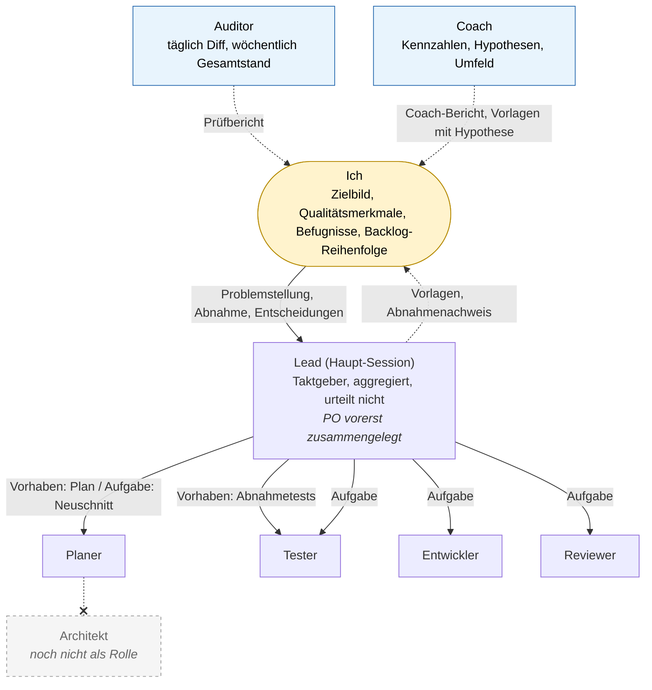
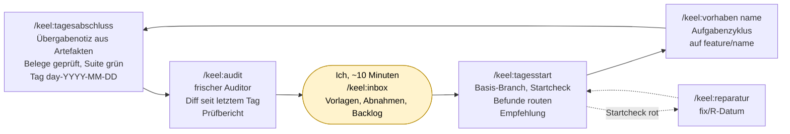
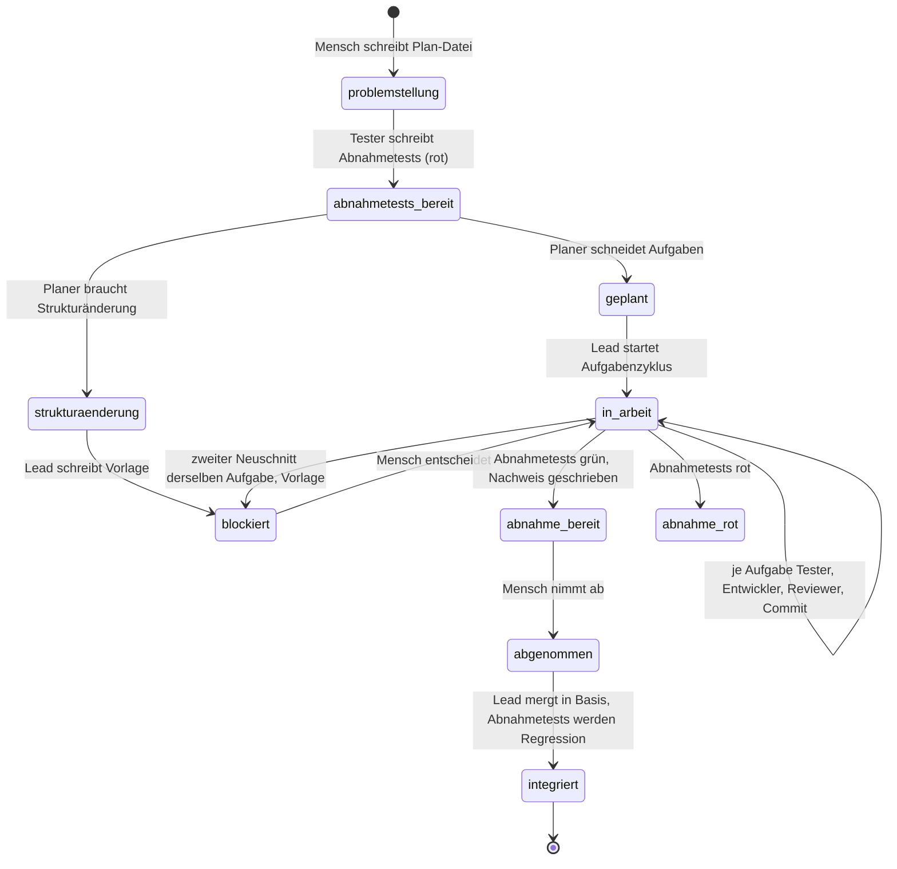
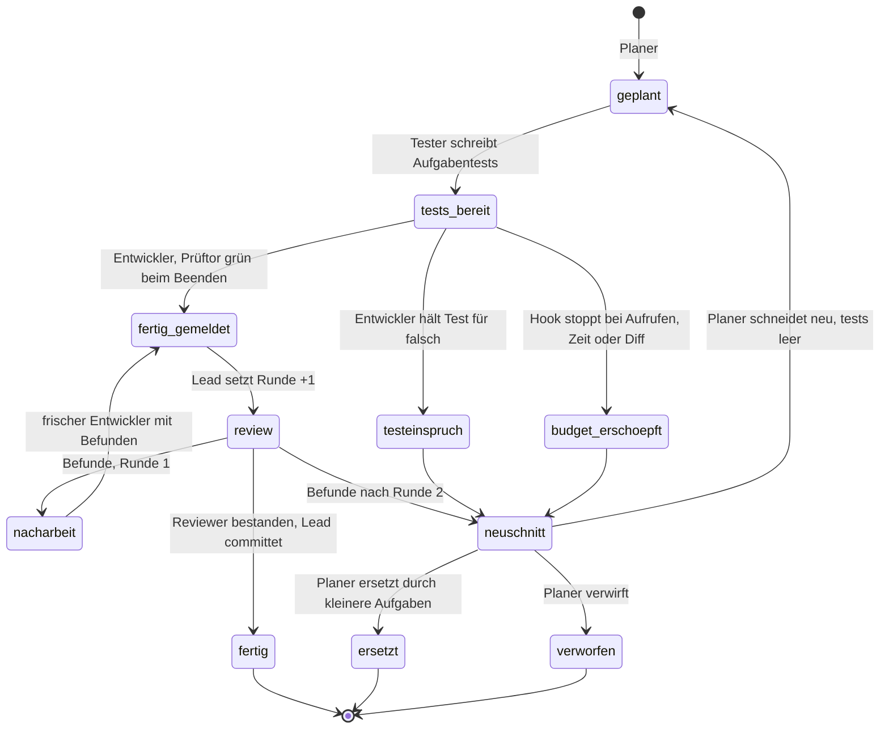
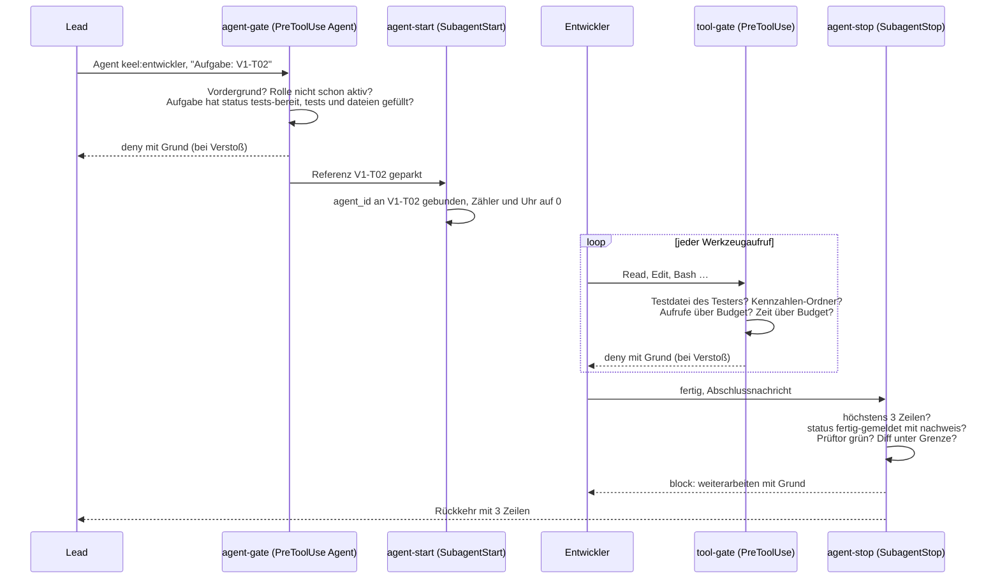
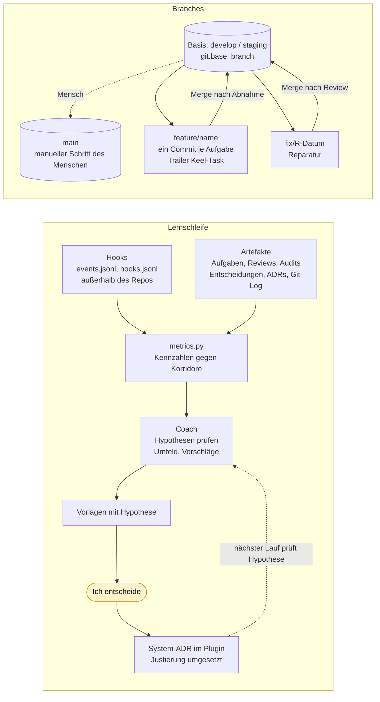

# keel auf einen Blick

Sechs Sichten auf dasselbe System. Alle Diagramme sind Mermaid und rendern direkt auf GitHub; die Quelle ist diese Datei.

## 1. Rollen und Beziehungen

Wer entscheidet, wer taktet, wer prüft. Durchgezogen: Aufruf oder Auftrag. Gestrichelt: Bericht. Der Mensch spricht nur mit dem PO (heute noch mit dem Lead zusammengelegt) und liest Auditor und Coach.

Auditor und Coach stehen außerhalb der Befehlskette. Sie werden nicht vom Lead aufgerufen, sondern über eigene Befehle (`/keel:audit`, `/keel:coach`), und sie ändern nichts außer ihrem Bericht.

## 2. Tagesrhythmus

Jeder Tag beginnt frisch aus Dateien. Zwischen Tagesabschluss und Tagesstart liegen Audit und die Runde des Menschen.

## 3. Ein Vorhaben von der Problemstellung bis zur Integration

Zustände des Plans. Der Mensch setzt genau zwei davon: `problemstellung` am Anfang und `abgenommen` am Ende.

## 4. Der Aufgabenzyklus mit seinen Rückläufen

Der Weg nach vorn ist kurz. Entscheidend sind die Rückläufe, und die sind feste Übergaben.

## 5. Was die Hooks um eine Rolle herum tun

Am Beispiel des Entwicklers. Jede Prüfung ist deterministisch und unabhängig vom Modell; blockiert wird mit dem konkreten Mangel, nicht mit einer Bitte.

## 6. Lernschleife und Branches

Links die Lernschleife: Rohdaten entstehen nebenbei, niemand meldet Kennzahlen. Rechts das Branch-Modell: `main` fasst das System nie an, außer es ist die konfigurierte Basis.

## 7. Wer schreibt was, wer liest was

| Artefakt | Schreibt | Liest | Prüft an der Grenze |
| --- | --- | --- | --- |
| `.keel/zielbild.md`, `qualitaetsmerkmale.md`, `befugnisse.md` | Ich | Lead, Planer, Auditor, Coach | – |
| `.keel/backlog.md` oder GitHub Issues | Ich (Reihenfolge), Tagesstart (Befunde), Auditor via Vorschlag | Lead, Auditor, Coach, nur über `backlog.py` | – |
| `.keel/work/plans/<name>.md` | Ich (Problemstellung), Tester (Abnahmetests), Planer (Aufgaben), Lead (Status) | alle Rollen des Vorhabens | agent-gate, agent-stop |
| `.keel/work/tasks/<ID>.md` | Planer, Tester, Entwickler, Lead (Status, Runden) | Tester, Entwickler, Reviewer, Auditor | agent-gate, agent-stop |
| `.keel/work/reviews/<ID>-r<n>.md` | Reviewer | Entwickler (Nacharbeit), Auditor, metrics.py | agent-stop |
| `.keel/work/acceptance/<name>.md` | Lead | Ich, Auditor | – |
| `.keel/work/handoff/<Datum>.md` | Lead (Tagesabschluss) | Tagesstart, Auditor | check_references.py |
| `.keel/work/audit/<Datum>.md` | Auditor | Ich, Tagesstart (Routing), Coach | agent-stop, route_findings.py |
| `.keel/work/coach/<Datum>.md` | Coach | Ich, nächster Coach | agent-stop |
| `.keel/decisions/pending/` | Lead, Coach, Tagesstart (aus Befunden) | Ich | Inbox |
| `.keel/adr/` | Planer (Entwurf), Ich, PO | alle | Inbox zeigt Proposed |
| `~/.keel-metrics/<projekt>/` | Hooks | Coach, metrics.py | tool-gate sperrt alle anderen Rollen |
