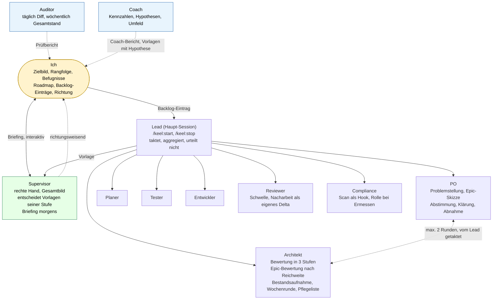
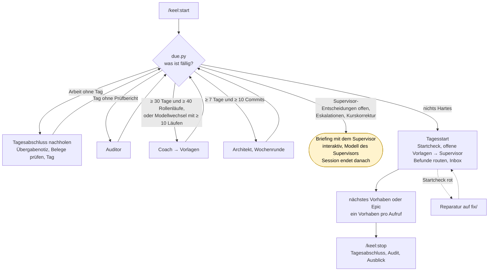
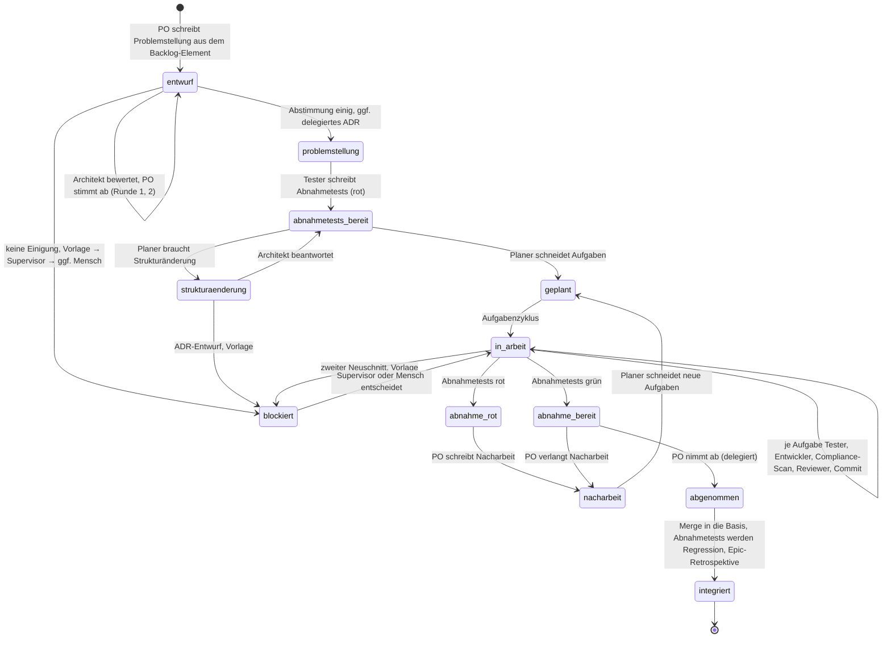
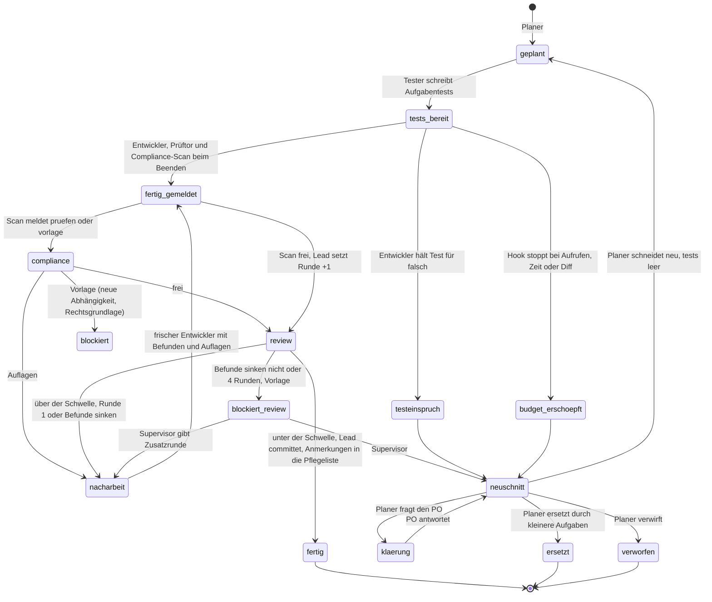
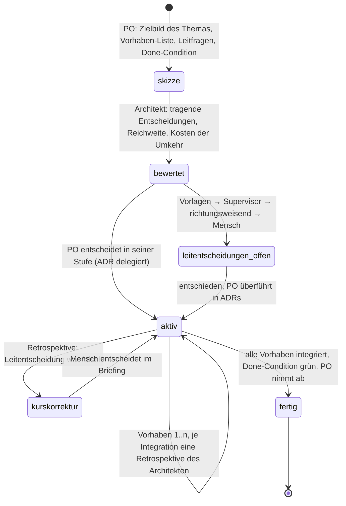
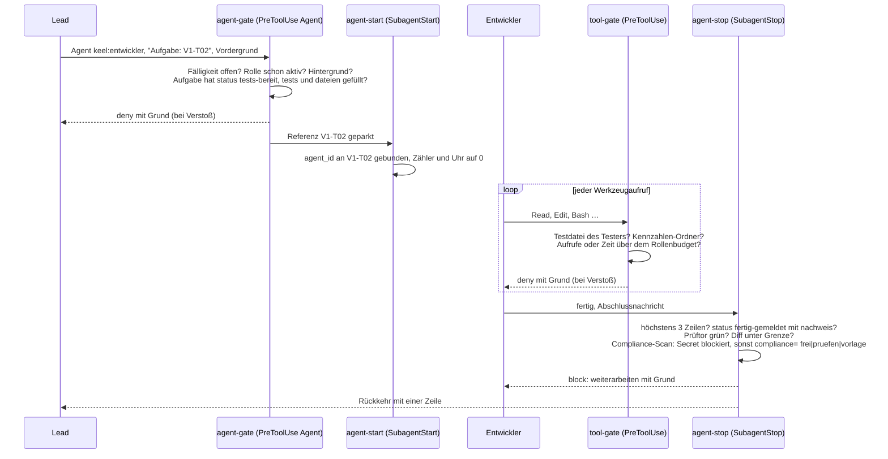
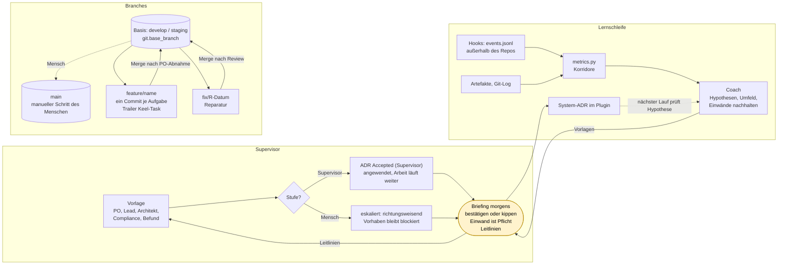

# keel auf einen Blick

Sieben Sichten auf dasselbe System, Stand 0.12. Alle Diagramme sind Mermaid und rendern direkt auf GitHub; die Quelle ist diese Datei.

## 1. Rollen und Beziehungen

Wer entscheidet, wer taktet, wer prüft. Durchgezogen: Aufruf oder Auftrag. Gestrichelt: Bericht oder Vorlage. Der Mensch spricht im Alltag nur mit dem Supervisor, im Morgen-Briefing, und schreibt Backlog-Einträge.

Auditor und Coach stehen außerhalb der Befehlskette und ändern nichts außer ihrem Bericht. Der Supervisor entscheidet innerhalb seiner Stufe der Befugnisse und reicht richtungsweisende Fragen weiter; jede seiner Entscheidungen erscheint im nächsten Briefing und kann gekippt werden.

## 2. Zwei Befehle und die Fälligkeiten

`/keel:start` liest den Zustand und tut, was fällig ist. Harte Fälligkeiten sperren per Hook alle Rollen außer der, die sie erledigt. `/keel:hilfe` steht daneben als Beobachter: Es erklärt den Stand aus `lage.py` (Fälligkeiten, Vorhaben, Vorlagen, Ereignisse nach Grund, Reste), nennt den nächsten Befehl und darf nur mit Ja des Menschen Reste aufräumen, einen Hinweis für den Coach ablegen oder einen Motor-Befund als Issue melden. Jede Ablehnung, die den Menschen erreicht, verweist darauf (System-ADR 0014). `/keel:monitor` zeigt dieselbe Lage laufend als lokale Webseite, mit einem Ablaufdiagramm (aktiv, bereit, gesperrt), Ereignisstrom, einer Zeitleiste je Vorhaben und allen Übergaben als Dokumente, und schreibt ebenfalls nichts; mit `monitor.autostart: true` starten ihn die Startbefehle mit. Die Startbedingungen der Rollen stehen in `scripts/flow.py`, aus dem Gate und Monitor lesen (System-ADR 0017).

## 3. Ein Vorhaben von der Problemstellung bis zur Integration

Zustände des Plans. Der Mensch setzt keinen davon mehr selbst; der PO nimmt delegiert ab, der Mensch sieht es im Briefing.

## 4. Der Aufgabenzyklus mit seinen Rückläufen

Der Weg nach vorn ist kurz. Entscheidend sind die Rückläufe, und die sind feste Übergaben.

## 5. Epic: Leitentscheidungen vor dem ersten Vorhaben

Für große Themen. Der Architekt bewertet nach Reichweite, welche Entscheidung im ersten Vorhaben ein späteres wieder umstoßen müsste.

## 6. Was die Hooks um eine Rolle herum tun

Am Beispiel des Entwicklers. Jede Prüfung ist deterministisch und unabhängig vom Modell; blockiert wird mit dem konkreten Mangel. Welcher Status für welche Rolle und welchen Anlass nötig ist und welche Rollen eine harte Fälligkeit freigibt, liest agent-gate aus `scripts/flow.py`, derselben Tabelle, aus der der Monitor „bereit“ und „gesperrt“ ableitet. Ist sie nicht lesbar, startet keine Rolle. Allgemein gilt der Fehlervertrag aus System-ADR 0019: Kann ein Gate nicht prüfen, weil ein Werkzeug fehlt, ein Feld leer ist oder ein Hilfsskript abstürzt, blockiert es mit Meldung, statt durchzulassen; Beobachter wie Protokoll und Kontext-Alarm protokollieren den Fehler als `hook_error` und lassen weiterlaufen. `python3 -m unittest discover -s tests/contract` prüft die Hooks von außen gegen feste Sollwerte, `python3 -m unittest discover -s tests/unit -t .` den Kern selbst, `python3 tests/gate/run.py --against main` vergleicht das Gate mit einem früheren Stand.

Hooks und Skripte lesen und schreiben nicht selbst, sondern über das Paket `lib/keel` (System-ADR 0020). Die Schicht `store` ist die einzige Stelle für Pfade (Laufzeit-Ordner `<projekt>-<hash>` je Projekt), Frontmatter und Konfiguration (ein strikter Codec, der Unverständliches mit Datei und Zeile ablehnt), Ereignisse (tolerant, in UTC) und gemeinsame Dateien (atomar und unter Sperre). `bin/keel path` liefert den Hooks die Pfade, `bin/keel doctor` prüft Projekt und Rechner; `/keel:hilfe` zeigt das Ergebnis im Abschnitt „Gesundheit“.

## 7. Supervisor-Schleife, Lernschleife, Branches

Links: Vorlagen laufen tagsüber über den Supervisor, morgens legt er vor. Mitte: die Lernschleife. Rechts: `main` fasst das System nie an, außer es ist die konfigurierte Basis.

## 8. Wer schreibt was, wer liest was

| Artefakt | Schreibt | Liest | Prüft an der Grenze |
| --- | --- | --- | --- |
| `.keel/zielbild.md`, `qualitaetsmerkmale.md`, `befugnisse.md` (drei Stufen), `roadmap.md` | Ich | Supervisor, PO, Architekt, Auditor, Coach | – |
| `.keel/leitlinien.md` | Supervisor, nur im Briefing | Supervisor, PO | – |
| `.keel/backlog.md` oder GitHub Issues | Ich (Reihenfolge), PO (Vorhaben, Folge-Elemente), Tagesstart (Befunde) | PO, Auditor, Coach, nur über `backlog.py` | – |
| `.keel/work/epics/<name>.md` (+ `.bewertung.md`) | PO, Architekt | PO, Architekt, Lead, Supervisor | agent-stop |
| `.keel/work/plans/<name>.md` | PO, Architekt (Bewertung), Tester, Planer, Lead (Status) | alle Rollen des Vorhabens | agent-gate, agent-stop |
| `.keel/work/tasks/<ID>.md` | Planer, Tester, Entwickler, Lead, Compliance-Scan | Tester, Entwickler, Reviewer, Compliance, Auditor | agent-gate, agent-stop |
| `.keel/work/reviews/`, `compliance/` | Reviewer, Compliance | Entwickler (Nacharbeit), Auditor, metrics.py | agent-stop (Schwelle und Trend über `review.py`) |
| `.keel/work/pflege.md` | agent-stop (Anmerkungen bestandener Reviews), Architekt (Sichtung) | Architekt, metrics.py | agent-stop (höchstens n Pflegeaufgaben je Wochenrunde) |
| `.keel/work/acceptance/<name>.md` | Lead | PO, Auditor | – |
| `.keel/work/handoff/<Datum>.md` | Lead (Tagesabschluss) | Tagesstart, Auditor | check_references.py |
| `.keel/work/audit/`, `architektur/` | Auditor, Architekt | Ich, Tagesstart (Routing), Coach | agent-stop, route_findings.py |
| `.keel/work/coach/`, `briefing/` | Coach, Supervisor | Ich, Coach | agent-stop |
| `.keel/work/hinweise/` | Ich, über `/keel:hilfe` | Coach (prüft, übernimmt nicht) | – |
| `.keel/decisions/pending/` → `done/` | PO, Lead, Coach, Tagesstart; entschieden vom Supervisor oder Mensch | Supervisor, Briefing, Inbox | agent-stop (Supervisor), briefing_needed.py |
| `.keel/adr/` | Planer (Entwurf), Architekt (Entwurf), PO (delegiert), Supervisor, Ich | alle | Inbox, Briefing, due.py |
| `~/.keel-metrics/<projekt>-<hash>/` (System-ADR 0020, `bin/keel path runtime`) | Hooks | Coach, metrics.py, due.py, lage.py (Hilfe, Monitor) | tool-gate sperrt alle anderen Rollen |
